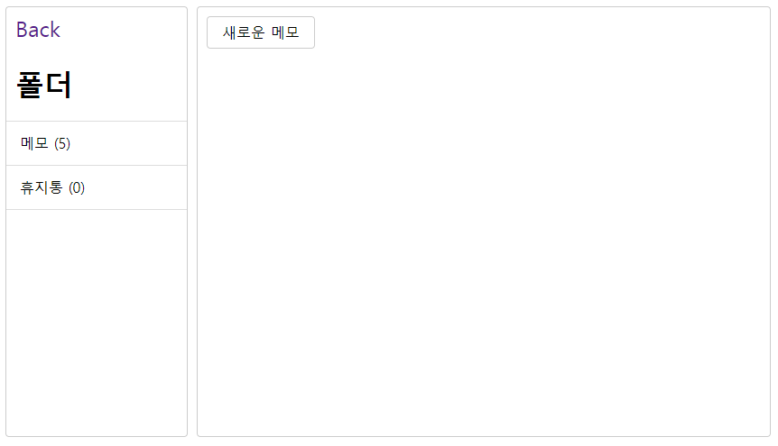
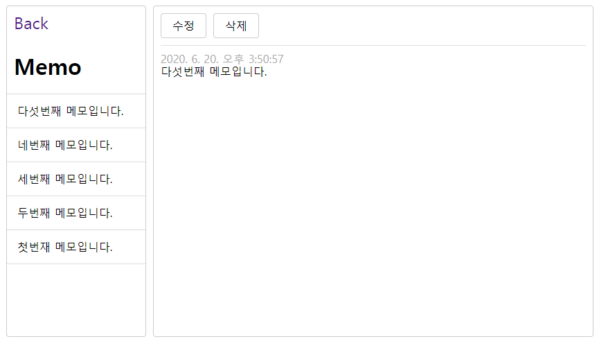
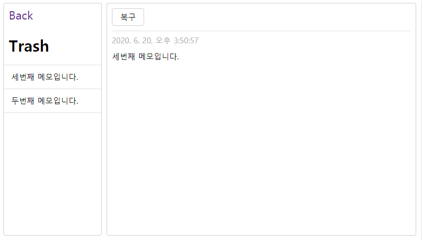

# Memo App

## intro
typescript with redux를 위한 간단한 메모 어플리케이션입니다.  
redux에 Typescript를 어떻게 적용해야할지를 중점적으로 학습하며 작업했습니다.   
이 레포지토리의 내용은 [김정환블로그](http://jeonghwan-kim.github.io/dev/2019/06/25/react-ts.html)의 코드 내용을 참조했습니다.

## todo
1. dialog
2. toast가 안나옴
3. 실패시 실패 알림 띄우기.
4. 수정버튼 만들기
5. indexDB를 사용해서 서버리스 환경으로 만들어보기
6. 리랜더링 최소화.
    - 컴포넌트 구조 분석

## Skill
- typescript 
- react 
- redux
- reudx-saga

## 사용 라이브러리

### 1. redux
- 컴포넌트간 결합도를 낮추기 위해서
- 비교 라이브러리(mobX)를 고려하지 않은 이유

### 2. react-redux
- redux store와 react 컴포넌트를 연결

### 3. redux-devtools-extension
- redux 디버깅

### 4. webpack
- 빌드
- 트랜스컴파일 (타입스크립트)

### 5. webpack-dev-servers
- 빌드 자동화
- hot module을 이용한 서버 리부팅.

### 6. typescript
- 정적 타이핑을 통한 컴파일 단계에서 에러체크 가능.
- 타입스크립트를 적용할때 문제가 될 수 있는 부분
    1. 코드 복잡도 증가
        - 타입스크립트 문법이 어색할 경우 코드가 한눈에 읽히지 않을 수 있다.
    2. 서브파티 라이브러리 호환성 
        - 비인기 라이브러리의 type호환여부.
    3. 도입 시점의 생산성 저하가 될 수 있음.
        - 프로젝트 규모에 따라 변곡점이 있다. 이걸 감안해서 도입해야한다. 

### 7. React-router-dom
    - 브라우저에서 사용하는 리액트 라우터.
    - 프론트 라우팅을 위함.
    - 프론트 라우팅을 하는 이유
        - 새로고침을 하게 되면 리소스를 다시 받아오게 된다.

### 8. Functional Component & hooks
    - hook: 함수형 컴포넌트를 사용하기 위해선 필수적으로 사용하게 됨(라이프사이클)
    - 그렇다면 함수형 컴포넌트를 쓴 이유?
        - 로직 재사용성
        - 불변성으로 인한 직관적인 코드, 테스트 코드 작성 용이

### 9. redux-saga
    - Redux패턴에서 action을 순수함수로 돌려놓음.
    - Action Creater 함수에 일관된 파라미터를 전달가능 (Thunk와 비교했을 때)
    - 다양한 상황의 사이드 이펙트 관리에 효율적임
    - 테스트가 쉬움(직접 경험x)

## 컴포넌트 설계
- [참고: 컴포넌트의 역할분리](https://jeonghwan-kim.github.io/dev/2020/01/28/component-design.html)

- 리랜더링을 최소화하는 구조..
- 왜 이렇게 컴포넌트를 분할했나?
- 어떻게 해야하는가?
- 이런식의 접근이 가능할텐데 생각해본적 없는지? 아니면 지금의 설계의 특별한 이유가 있는지?
- 이런 구조에서 발생하는 문제에 대해서 어떻게 대처할 것인지?

## 비동기 처리
- 세션처리는?
- 요청중인 비동기처리를 취소해야할 떄는?
- 비동기처리를 Redux 미들웨어에서 하지않고 컴포넌트에서 처리했을때 뭐가 문제라고 생각하나?
    - 컴포넌트의 복잡도가 증가한다.
    - 비지니스로직이 컴포넌트마다 분산됨으로 관리가 어려워진다. 

- 비동기처리를 Redux 미들웨어에서 하는 가장 큰 이유가 뭐라고 생각하나?

## 폴더구성

### actions
액션 타입과 이를 포함한 액션 객체를 생성하는 액션 생성함수 정의

### reducers
스토어 타입과 초기값을 설정해서 스토어 구조를 만든다. 액션에 따라 스토어를 갱신하는 리듀서를 정의한다.

### store
리듀서를 가져와 스토어를 만든다. 스토어는 루트 컴포넌트에 주입되는데 프로바이더 컴포넌트를 이용한다.

### constainer
액션 생성자 디스패처와 스토어가 연결된 컴포넌트를 만든다. 행동을 기술한 컴포넌트

### pages  
라우터를 기준으로 정리했다. 해당 컴포넌트들은 컨테이너 컴포넌트와 공통 컴포넌트로 페이지의 구조를 잡는 역할만 한다.

### sagas
각 비동기로직을 처리할 saga를 정의한다.  
rootSaga에서 RootState를 export해서 각 컴포넌트에서 store에서 관리중이 state의 구조를 확인하도록 한다.  

## Typescript 적용범위

### 1. Presetainal Component
- props
- state

### 2. Container Compoennt
- store 접근시 RootState에 존재하는 값인지 체크.

### 3.Actions
- Reqeust payload Type

### 4.Reducers
- initState
- rootSate 정의

## Ref
- [라우터1](https://velopert.com/3417)
- [라우터2](http://jeonghwan-kim.github.io/dev/2019/07/08/react-router-ts.html)
- [기본환경 셋팅](http://jeonghwan-kim.github.io/dev/2019/06/25/react-ts.html)
- [redux-ts](http://jeonghwan-kim.github.io/dev/2019/07/15/react-redux-ts.html)